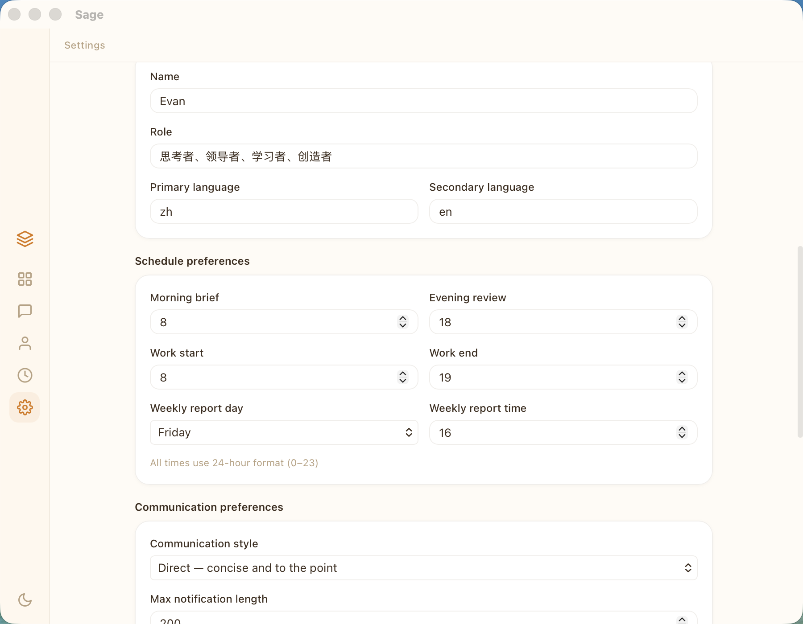

# Sage — Personal AI Advisor System

> **不是替身，是参谋。** 决策权永远在你，Sage 提供推荐方案 + 理由 + 备选项。

Sage is a personal AI advisor built in Rust. It learns your decision frameworks, communication patterns, and management philosophy — then provides structured advice when you need it.

<!-- TODO: Add screenshots -->
<!--  -->
<!--  -->

## Architecture

```
┌─────────────────────────────────────────────────┐
│                  Sage Desktop                    │
│              (Tauri + React + TS)                │
│   ┌──────┐ ┌──────┐ ┌──────┐ ┌──────┐          │
│   │ Chat │ │Dash- │ │About │ │Sett- │          │
│   │      │ │board │ │ You  │ │ings  │          │
│   └──┬───┘ └──┬───┘ └──┬───┘ └──┬───┘          │
│      └────────┴────────┴────────┘                │
│                    │ Tauri IPC                    │
└────────────────────┼─────────────────────────────┘
                     │
┌────────────────────┼─────────────────────────────┐
│              sage-core (Rust)                     │
│                    │                              │
│  ┌─────────┐  ┌───┴────┐  ┌──────────────┐      │
│  │  Agent   │  │ Store  │  │   Router     │      │
│  │(LLM call)│  │(SQLite)│  │(event→action)│      │
│  └────┬─────┘  └───┬────┘  └──────┬───────┘      │
│       │            │              │               │
│  ┌────┴─────────┐  │   ┌─────────┴────────┐      │
│  │ Reliable     │  │   │ Coach / Mirror /  │      │
│  │ Provider     │  │   │ Questioner /      │      │
│  │ + HintRouter │  │   │ Guardian          │      │
│  └──────────────┘  │   └──────────────────┘      │
│                    │                              │
└────────────────────┼──────────────────────────────┘
                     │
┌────────────────────┼──────────────────────────────┐
│            sage-daemon (background)                │
│                    │                               │
│  ┌─────────┐ ┌────┴────┐ ┌───────────┐           │
│  │Heartbeat│ │Channels │ │ Daemon    │           │
│  │(cron)   │ │email/cal│ │ (event    │           │
│  │         │ │hooks/wx │ │  loop)    │           │
│  └─────────┘ └─────────┘ └───────────┘           │
└───────────────────────────────────────────────────┘
```

## Key Features

| Feature | Description |
|---------|-------------|
| **Unified Memory** | SQLite-backed memory with keyword search, replacing fragmented file storage |
| **Reliable Provider** | Exponential backoff retry + automatic fallback to alternate LLM providers |
| **Hint Router** | Route tasks to different models — `hint:reasoning` → Opus, `hint:fast` → Haiku |
| **Cognitive Triangle** | Coach (pattern learning) → Mirror (gentle reflection) → Questioner (Socratic questions) |
| **Agent Guardrails** | Max iteration limits, history windowing (20 msgs), credential scrubbing |
| **Mental Models** | Encoded decision frameworks, communication matrix, people assessment |
| **Desktop UI** | Tauri app — Chat, Dashboard, About You (memory), Settings |
| **Background Daemon** | macOS LaunchAgent — email/calendar polling, heartbeat scheduling |

## Tech Stack

| Layer | Technology |
|-------|-----------|
| Runtime | Rust, ~3MB binary, <5MB RAM |
| Storage | SQLite (WAL mode, shared by daemon + desktop) |
| Desktop | Tauri v2 + React 18 + TypeScript |
| LLM | Claude (CLI + HTTP API), Codex, Gemini — multi-provider |
| Channels | AppleScript (Outlook email/calendar), Claude Code hooks, WeChat sidecar |
| Deployment | macOS LaunchAgent (auto-start + crash recovery) |

## Project Structure

```
sage/
├── crates/
│   ├── sage-types/              # Shared types (Event, Memory, UserProfile...)
│   ├── sage-core/               # Core library
│   │   ├── agent.rs             #   LLM invocation + guardrails
│   │   ├── reliable_provider.rs #   Retry + fallback wrapper
│   │   ├── hint_router.rs       #   Task-based model routing
│   │   ├── store.rs             #   SQLite storage (unified memory)
│   │   ├── router.rs            #   Event classification + handling
│   │   ├── daemon.rs            #   Event loop orchestrator
│   │   ├── channels/            #   email, calendar, hooks, wechat
│   │   ├── coach.rs             #   Pattern learning → insights
│   │   ├── mirror.rs            #   Gentle behavioral reflection
│   │   ├── questioner.rs        #   Socratic deep questions
│   │   ├── guardian.rs          #   Rule-based wellbeing checks
│   │   ├── scrub.rs             #   Credential redaction
│   │   └── ...
│   └── sage-daemon/             # Background daemon binary
├── apps/
│   └── sage-desktop/            # Tauri desktop app
│       ├── src/                 #   React frontend
│       │   ├── pages/           #     Chat, Dashboard, AboutYou, Settings...
│       │   └── App.css          #     Styles
│       └── src-tauri/           #   Rust backend
│           ├── commands.rs      #     Tauri IPC commands
│           └── main.rs          #     App entry + embedded daemon
├── mental-models/               # Decision & communication frameworks
├── .context/                    # Team, projects, stakeholders, vocabulary
├── templates/                   # Email, weekly report, meeting note templates
├── docs/plans/                  # Implementation plans
└── sop/                         # Standard Operating Procedures
```

## Stats

| Metric | Value |
|--------|-------|
| Rust code | ~7,000 lines |
| Frontend code | ~3,900 lines |
| Tests | 83 (all passing) |
| Clippy | 0 warnings |
| Binary size | ~3MB |

## Quick Start

### Desktop App

```bash
cd sage/apps/sage-desktop
bun install
bun run tauri dev
```

### Daemon (background)

```bash
cd sage
cargo build --release -p sage-daemon
cp target/release/sage-daemon ~/.sage/bin/
launchctl load ~/Library/LaunchAgents/com.sage.daemon.plist
```

### Claude Code Integration

```bash
cd ~/dev/digital-twin
claude   # auto-loads CLAUDE.md, Sage ready
```

#### Custom Commands

```
/project:email-draft    Draft bilingual work emails
/project:weekly-review  Generate weekly progress reports
/project:meeting-prep   Prepare meeting talking points
/project:code-review    Review code (Rust/Python focus)
/project:translate      CN↔EN with accurate tech terms
/project:strategy-note  Structure strategic observations
/project:team-feedback  Generate team member feedback
```

## Design Philosophy

> "参谋不替主帅做决定，但要让主帅在 3 秒内做出决定。"
>
> *An advisor doesn't make decisions for the commander — but enables the commander to decide in 3 seconds.*

### Core Principles

1. **Advise, don't decide** — Always present options with trade-offs
2. **Think in Chinese, output in English** — Help structure thoughts in native language, express precisely in English
3. **Direction, not path** — Give frameworks, not step-by-step instructions
4. **Systems thinking** — See the structure behind symptoms
5. **Pragmatism** — Good enough beats perfect

## Inspired By

Architecture patterns borrowed from [ZeroClaw](https://github.com/zeroclaw-labs/zeroclaw) — a lightweight Rust AI agent runtime:

- **Unified Memory trait** with SQLite backend (adapted: LIKE search for CJK, no FTS5)
- **ReliableProvider** pattern (retry + fallback chain)
- **HintRouter** for task-based model routing
- **Agent guardrails** (iteration limits, history compression, credential scrubbing)

## License

Private project. Not for redistribution.
