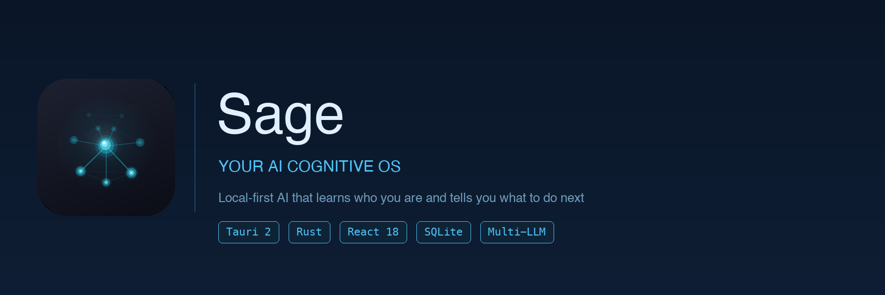

[English](README.md) | [中文](README.zh-CN.md)

<p align="center">
  
</p>

<h1 align="center">Sage</h1>

<p align="center">
  <strong>本地优先的 AI 认知操作系统——了解你是谁，观察你在做什么，告诉你下一步该做什么。</strong>
</p>

<p align="center">
  <em>你的数据从不离开你的设备。一次都不会。</em>
</p>

<p align="center">
  <a href="#快速开始">快速开始</a> •
  <a href="#工作原理">工作原理</a> •
  <a href="#功能特性">功能特性</a> •
  <a href="#插件系统">插件</a> •
  <a href="#架构">架构</a> •
  <a href="#贡献">贡献</a>
</p>

<p align="center">
  
  
  
  
  
  
</p>

---

## 痛点

你带一个团队，每天 6 个会。决策在 Teams 里做，跟进在邮件里发，上下文全在脑子里。到了周五，你已经忘了周一承诺了什么。

现有工具帮不上忙——任务管理器需要手动输入，AI 助手每次对话都从零开始，而有趣的工具全要把数据发到别人的服务器上。

## Sage 做什么

Sage 作为后台 daemon 运行在你的 Mac 上。它监控你的邮件、日历和聊天工具（通过 Chrome 插件桥接 Teams/Slack）。它构建关于你的结构化记忆——你是谁、你在做什么、什么对你重要。然后做三件事：

**1. 记住你会忘记的事。**
每一次对话、每一个决定、每一个承诺都被索引到本地 SQLite 数据库中，支持全文搜索。Sage 不只是存日志——它提取模式、构建认知画像、跨越数周数月连接线索。

**2. 告诉你今天该做什么。**
每天早上，Sage 生成简报：今天有什么会、哪些任务待办、什么需要关注。它将待办任务与近期事件交叉对比，建议哪些已完成、哪些该取消、应该新建什么。

**3. 反映你可能忽视的。**
基于规则的 Mirror Layer 检测你文本中的犹豫、矛盾和脆弱时刻——"铠甲上的裂缝"，揭示你真正卡住或在成长的地方。周度镜像报告呈现未解决的线索和行为偏离，不评判、不建议。

## 工作原理

```
你正常工作
     │
     ▼
┌─────────────────────────────────────────────────┐
│  浏览器桥接（Chrome 插件）                        │
│  捕获：Teams 聊天、邮件、AI 对话                   │
│  方式：XHR 拦截 + Native Messaging               │
│  隐私：所有数据只发送到本地进程                     │
└──────────────────────┬──────────────────────────┘
                       │
                       ▼
┌─────────────────────────────────────────────────┐
│  Sage Daemon（后台，每 N 分钟运行一次）             │
│                                                 │
│  ┌─────────┐  ┌──────────┐  ┌───────────────┐  │
│  │ Observer │→ │  Coach   │→ │    Mirror     │  │
│  │ 原始     │  │ 行为     │  │  认知         │  │
│  │ 事件     │  │ 模式     │  │  画像         │  │
│  └─────────┘  └──────────┘  └───────┬───────┘  │
│                      │              │           │
│              ┌───────┴───────┐  ┌───┴────────┐  │
│              │ 任务引擎      │  │ 反思信号    │  │
│              │ 待办 ×       │  │ 检测器      │  │
│              │ 近期事件     │  │ 7 种类型    │  │
│              │ → 建议       │  │             │  │
│              └───────────────┘  └────────────┘  │
└──────────────────────┬──────────────────────────┘
                       │
                       ▼
┌─────────────────────────────────────────────────┐
│  SQLite（WAL 模式, FTS5, 31 次迁移）              │
│  ~/.sage/data/sage.db                           │
│                                                 │
│  记忆 → 结构化、索引化、图谱关联                    │
│  任务 → 带来源、优先级、截止日期                    │
│  画像 → 不断演化的认知模型                         │
│  信号 → 反思时刻，强度评分                         │
└─────────────────────────────────────────────────┘
                       │
                       ▼
              桌面 UI（Tauri 2，中英双语）
              + 插件输出（TickTick, Todoist 等）
              + macOS 通知
```

## 功能特性

### 主动智能
后台 daemon 轮询邮件和日历，自动生成**晨间简报**、**晚间回顾**和**周报**。你打开电脑，一天已经整理好了。

### 深度记忆
每次对话积累结构化记忆，FTS5 索引。未来的交互按语义相似度召回相关上下文。Sage 不从零开始——它从关于你的一切开始。

### 认知深度
记忆分为四个层级：**事件**（发生了什么）→ **模式**（什么在重复）→ **判断**（你相信什么）→ **信念**（你不会妥协的）。记忆演化基于证据自动在层级间晋升。

### 记忆演化
自动化 6 阶段生命周期保持记忆锐利：
**合并相似** → **提炼特征** → **压缩冗余** → **关联链接** → **衰减过时** → **验证晋级**

### 记忆图谱
力导向图可视化你的记忆网络。边权重通过 Hebbian 共激活强化——一起被激活的记忆，会被连接在一起。冷边随时间衰减。

### 任务智能
每 3 个 daemon tick，待办任务与近期事件交叉对比。Sage 建议：**完成**（附证据）、**取消**（已过时）或**新建**（从对话中检测到）。每个任务获得针对其具体内容定制的 LLM 验收问题——不是通用选项。

### 反思信号检测
零 LLM 成本的规则引擎扫描每段输入文本，检测 7 种信号类型：**不确定**、**自我矛盾**、**脆弱**、**防御性抽象**、**卡住状态**、**自我分析**和**基线偏离**。周度镜像报告汇总这些信号——什么未解决、你在哪里偏离了自己的模式、你在哪里部署了"铠甲"。

### 认知链路
**Observer** → **Coach** → **Mirror** → **Questioner** → **Strategist**：原始事件转化为语义标注，然后是行为模式，然后是认知洞察，然后是反思式提问，最后是战略分析。

### Skill 路由
自动人格切换：**Strategist** 处理工作决策，**Companion** 用于个人反思。每个 skill 有独立的系统 prompt 和行为规则。

### 多 LLM 支持
Claude CLI、Codex CLI、Gemini CLI、Cursor CLI、Anthropic API、OpenAI API、DeepSeek API。优先级排序，支持按模型独立配置和思考深度控制。

### 浏览器桥接
Chrome 插件（MV3）同步 Claude/ChatGPT/Gemini 的 AI 对话并捕获浏览上下文。XHR 拦截 + Native Messaging 将一切传回本地 Sage 进程。**没有任何数据接触外部服务器。**

### 双语界面
完整中英文界面，479 个翻译键。语言跟随 profile 设置即时切换——无需重启。所有 LLM prompt 同样遵循语言偏好。

### 自我校准
Dashboard 支持内联纠正：当 Sage 说错了，你引用错误、提供事实，它就会校准。纠正积累为校准规则，防止重复犯错。

## 插件系统

Sage 插件是**任意语言的独立进程**。只要能从 stdin 读 JSON，就是 Sage 插件。

```
Sage 写任务到 SQLite
     │
     ▼
插件 Hook 触发
     │
     ▼
┌─────────────────────────────┐
│ stdin (JSON)                │
│ {                           │
│   "event": "task_created",  │
│   "task": {                 │
│     "content": "...",       │
│     "priority": "high",    │
│     "due_date": "...",      │
│     "description": "..."   │
│   }                         │
│ }                           │
└──────────────┬──────────────┘
               │
               ▼
     你的代码（任意语言）
               │
               ▼
┌─────────────────────────────┐
│ stdout (JSON)               │
│ { "status": "ok" }          │
└─────────────────────────────┘
```

**内置：** TickTick 同步（Rust）
**社区：** Todoist、Apple Reminders、Notion — 欢迎 PR。

```toml
# ~/.sage/config.toml
[[plugins]]
name = "ticktick"
command = "sage-plugin-ticktick"
on = ["task_created", "task_updated"]
```

## 技术栈

| 层级 | 技术 |
|------|------|
| 桌面端 | **Tauri 2** — Rust 后端，单一二进制 |
| 前端 | **React 18** + TypeScript + react-router-dom |
| 存储 | **SQLite** — WAL 模式，FTS5 全文搜索，31 次迁移 |
| LLM | 多 Provider 优先级队列 + 按模型独立配置 |
| 国际化 | 零依赖双语系统（en/zh），479 个翻译键 |
| 平台 | macOS 14+ — LaunchAgent 驱动后台 daemon |
| 插件 | Chrome MV3 — 浏览器桥接 |

## 项目结构

```
sage/
├── apps/sage-desktop/           # Tauri 桌面应用
│   ├── src/                     # React 前端（11 个页面）
│   │   ├── i18n.ts              # 双语翻译字典
│   │   ├── LangContext.tsx      # 语言上下文 Provider
│   │   └── pages/               # Dashboard, Chat, Tasks, Settings, ...
│   └── src-tauri/               # Rust 后端（commands, tray, daemon）
├── crates/
│   ├── sage-core/               # 核心逻辑（356 个测试）
│   │   ├── daemon.rs            # 后台事件循环
│   │   ├── store.rs             # SQLite 存储（31 次迁移）
│   │   ├── provider.rs          # LLM Provider 抽象层
│   │   ├── discovery.rs         # 自动发现已安装 CLI 及 API
│   │   ├── memory_evolution.rs  # 6 阶段记忆生命周期管理
│   │   ├── task_intelligence.rs # 任务信号检测
│   │   ├── reflective_detector.rs # 规则引擎反思信号检测
│   │   ├── mirror.rs            # 每日反映 + 周度镜像报告
│   │   ├── observer.rs          # 原始事件 → 语义标注
│   │   └── ...
│   └── sage-types/              # 共享类型定义
├── plugins/                     # 插件实现（TickTick 等）
├── skills/                      # LLM Skill 文件（人格定义）
├── extensions/chrome/           # 浏览器桥接插件（MV3）
└── launchd/                     # macOS LaunchAgent 模板
```

## 快速开始

### 环境要求

- macOS 14+
- Rust 工具链（`rustup`）— 通过 `rust-toolchain.toml` 固定到 `1.92.0`
- Node.js 20+（推荐 `fnm`）
- 至少一个 LLM Provider — 推荐：[Claude CLI](https://docs.anthropic.com/en/docs/claude-code)

### 构建与运行

```bash
git clone https://github.com/EvanL1/sage.git
cd sage/apps/sage-desktop

npm install
cargo tauri dev        # 开发模式（热重载）
cargo tauri build      # 生产构建
```

### 配置

```bash
cp config.example.toml ~/.sage/config.toml
vim ~/.sage/config.toml
```

数据：`~/.sage/data/sage.db` — 日志：`~/.sage/logs/`

### 开发命令

```bash
cargo check --workspace       # 类型检查
cargo clippy --workspace      # Lint
cargo test --workspace        # 运行全部测试（356）
npx tsc --noEmit              # TypeScript 检查（在 apps/sage-desktop 下）
```

## 架构

```
后台 Daemon（事件循环）：
  tick() → 邮件/日历轮询 → 时间窗口检查 → Skill 路由
  → LLM 调用 → 记忆持久化 → 反思信号检测 → macOS 通知

桌面聊天：
  invoke("chat") → FTS5 记忆搜索 + 图谱增强检索
  → route_chat_skill() → SKILL.md + 用户上下文 → LLM → 解析记忆 → 回复

任务智能（每 3 个 tick）：
  待办任务 × 近期事件 → LLM 对比 → 完成 / 取消 / 新建信号 → 用户审阅

记忆演化（每日或手动）：
  合并 → 提炼 → 压缩 → 链接 → 衰减 → 晋级

镜像层（持续 + 周度）：
  文本 → 规则引擎信号检测（7 种类型） → SQLite
  每周 → LLM 聚合 → 镜像报告（未解决 / 偏离 / 铠甲 / 开放问题）
```

## 设计哲学

> "参谋不替主帅做决定，但要让主帅在 3 秒内做出决定。"

1. **辅助决策，不替代决策。** 给选项 + trade-off + 推理。你来决定。
2. **系统思考。** 看结构，不看表面症状。
3. **实用主义。** 能用就发。
4. **给方向不给路径。** 提供框架，不提供指令。

## 对比

| | Sage | Motion / Reclaim | Mem0 / MemOS |
|---|---|---|---|
| **本地运行** | 所有数据在你的设备上 | 云端 | 可选 |
| **认知画像** | 学习你是谁 | 否 | 仅记忆 |
| **任务智能** | 交叉对比事件 | 自动排期 | 否 |
| **反思信号** | 检测犹豫、矛盾 | 否 | 否 |
| **记忆演化** | 6 阶段生命周期 | 否 | 是 |
| **双语** | 完整中英文 UI + prompt | 仅英文 | 仅英文 |
| **插件系统** | 任意语言 stdin/stdout | 否 | 否 |
| **开源** | MIT | 否 | 是 |

## 路线图

- [ ] Linux 支持（systemd daemon）
- [ ] Windows 支持（Windows Service）
- [ ] 插件市场
- [ ] 移动端（只读视图）
- [ ] CalDAV / CardDAV 集成
- [ ] MCP 服务器模式（将 Sage 暴露为其他 agent 的工具）

## 贡献

Sage 是一个人为了解决真实问题而构建的个人项目。欢迎贡献。

**适合新手的 issue：**
- 为你喜欢的任务应用写插件（Todoist、Notion、Apple Reminders）
- 改进记忆演化启发式规则
- 添加新的 LLM Provider 支持
- Linux/Windows daemon 实现

```bash
# 提交前运行测试
cargo test --workspace
cargo clippy --workspace
```

## License

MIT — 随便用。

---

<p align="center">
  <strong>由 <a href="https://github.com/EvanL1">Evan</a> 构建。</strong><br/>
  <em>因为最好的 AI 助手，是那个已经知道你需要什么的。</em>
</p>
